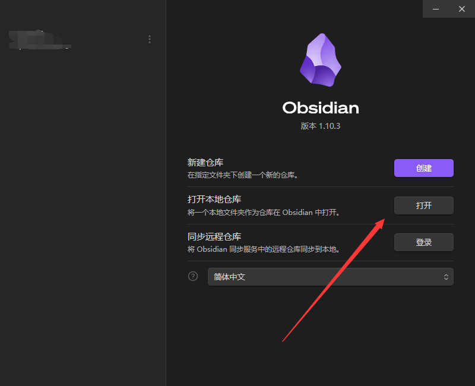
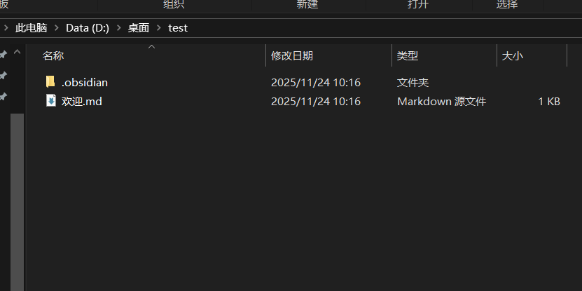
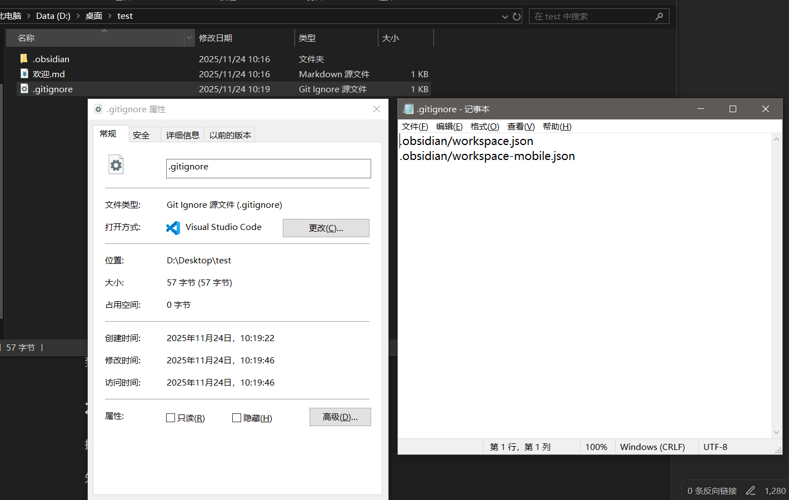
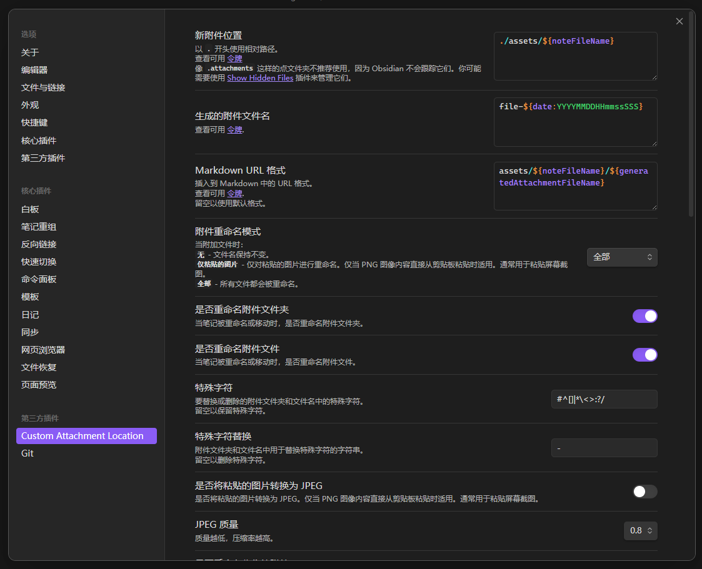
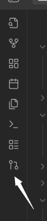
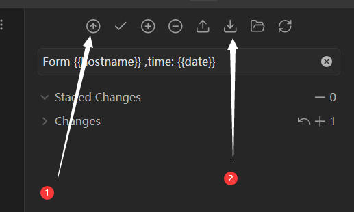

# 安装

首先需要下载安装`git`与`obsidian`

[git官方网站](https://git-scm.com/install/windows)

[Obsidian官方网站](https://obsidian.md/download)

一路默认即可

`git`安装完成后需要在Windows命令行(cmd)中输入以下命令测试一下:
```
git -v
```

如果出现版本如:
```
git version 2.52.0.windows.1
```

则表示安装完成

安装完成`git`之后,请先执行以下命名来初始化git提交的来源信息:

```
git config --global user.email "你的邮箱"
```

```
git config --global user.name "你希望展示的昵称"
```

---

# 生成与配置SSH密钥

然后是基础配置,首先在任意目录的cmd中输入:

```
git config --global core.sshCommand "C:/Windows/System32/OpenSSH/ssh.exe"
```

将`git`的`ssh`强制改为Windows内置的`ssh`

输入以下命令来检查是否成功:

```
git config --global core.sshCommand
```

如果得到的结果是:

```
C:/Windows/System32/OpenSSH/ssh.exe
```

则说明该项配置成功

接下来创建ssh密钥对:

```
ssh-keygen -t ed25519 -C "你的Obsidian同步专用邮箱@example.com"
```

会生成一个公钥,一个私钥

> [!NOTE] 注意
> 此处 `你的Obsidian同步专用邮箱@example.com` 的内容可以换为任意值,仅仅用于注释

创建完成后在命令行中输入以下内容来检验ssh是否连接成功:

```
ssh -T git@github.com
```

按照得到的指示去做,最后会得到如下反馈:

```
Hi <你的用户名>! You've successfully authenticated, but GitHub does not provide shell access.
```

接着去目录`C:\Users\"你的用户名"\.ssh`下去寻找一下两个文件:

```
id_ed25519

id_ed25519.pub
```

其中请用记事本打开`id_ed25519.pub`文件,然后将内容全部复制下来

下一步打开并登录[github网站](https://github.com/explore),在用户设置中找到`SSH and GPG keys`项,在`SSH keys`板块中点击`New SSH key`添加新的SSH key,种类选择`Authentication Key`,在下方`key`一栏中粘贴刚刚复制的内容,并在上方`title`添加好注释,确认无误后点击`Add SSH key`完成云端配置.

---
# 克隆远程仓库与初始化

回到github网站的用户主界面,找到创建好的私人仓库,点击醒目的绿色的`<> Code`键,选择`SSH`并复制

你复制的可能是以下内容:

```
git@github.com:"你的用户名"/"你的仓库名".git
```

待会需要直接粘贴

接下来回到本地,创建一个固定的文件夹准备容纳远程仓库克隆的内容

比如:

`C:\Users\"你的用户名"\Documents\OBsidianFile`

然后打开该文件夹的命令提示符(小黑窗)后,==输入以下两命令中的一个==(请看完):

```
git clone git@github.com:"你的用户名"/"你的仓库名".git
```

该命令的效果是在你选择的本地文件夹中创建一个新的文件夹作为仓库

或者:

```
git clone git@github.com:"你的用户名"/"你的仓库名".git .
```

该命令的效果是直接选择你创建的这个文件夹作为仓库

执行完成后即可在本地用obsidian打开该目录:


> [!danger] 注意
> 选择文件夹请认准仓库的位置
> 如果用的是上方第一个命令,请选择自动新建的那个文件夹
> 而如果用的是第二个命令,请选择你创建的那个文件夹

第一次用Obsidian打开后,在文件资源管理器中查看会是这样的:



在此文件夹中,先创建一个文本文档,添加内容:

```
.obsidian/workspace.json
.obsidian/workspace-mobile.json
```

然后保存关闭并将其改名为`.gitignore`,如下图:



到此本地克隆与初始化完成

---

# 额外的本地文件配置

接着该配置`Obsidian`的git插件

先用`Obsidian`打开刚刚克隆好的笔记文件夹

打开 `设置` ,找到 `第三方插件` 这一栏,关闭 `安全模式` ,浏览 `社区插件市场`

搜索`git`,下载并启用,启用后设置中左下方会多出一栏`git`,点击

主要把:

`Auto commit-and-sync interval (minutes)` 推荐设置为`2`或以上

`Auto commit-and-sync after stopping file edits`该项打开

git的下方其他各种设置随意

然后同样的方法,下载插件`Custom Attachment Location`

并调整成如图:


完成全部配置

在编辑文档的时候左侧会出现一个分支控制按钮:



打开会在右侧出现控制栏:



1. 可以向云端同步本地的更新
2. 可以从云端下载更新
或者也可以完全不管,在设定的时间(本教程上方推荐设置为`2`的那个值)到了之后会自动同步


> [!danger] 注意
> 不建议==多端同时编辑一个文件==,会出现需要处理冲突的情况

到此教程结束,愉快的进行`md`文档编辑吧🥳🥳

觉得实用请赏个星吧✨