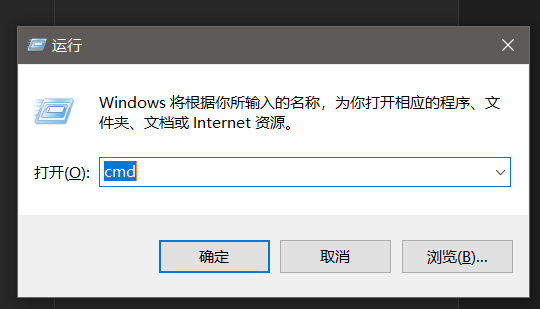
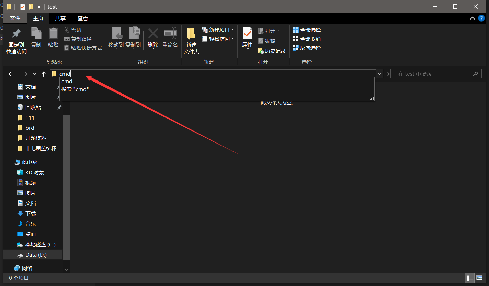

# 一般打开方法

`cmd`指的是`Windows`系统的命令提示符,可以通过按住`win`键并点击`R`键并输入cmd并按下`enter`来打开↓↓↓



或者同样可以按下`win`然后输入`cmd`来打开↓↓↓


# 如何打开某一路径下的cmd

有时会需要:

```
在某一目录/路径下打开cmd
```

这样的操作

需要用户先在Windows文件资源管理器打开该路径(这里演示的目录是`D:\test`):


然后点击此处并输入`cmd`然后按下`enter`↓↓↓



会出现cmd窗口:


显示出:

```
D:\test>
```

表示成功打开了这一路径下的cmd